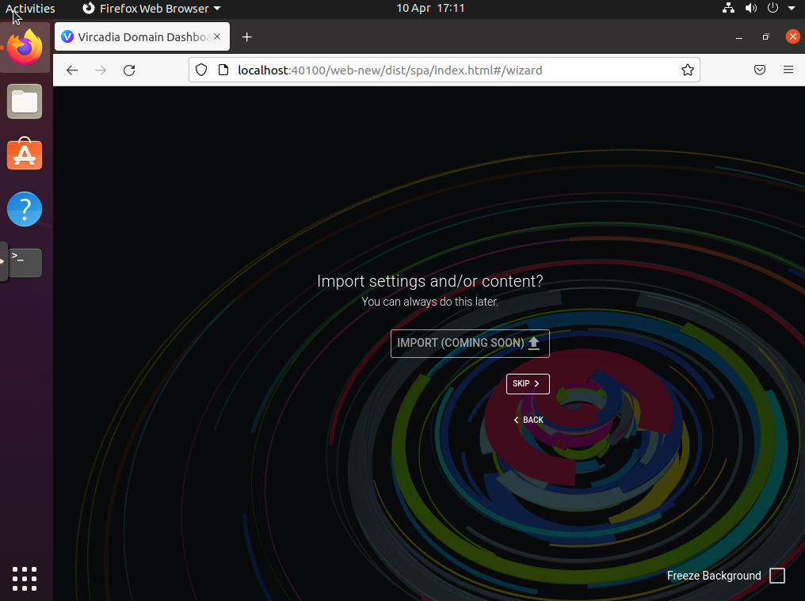
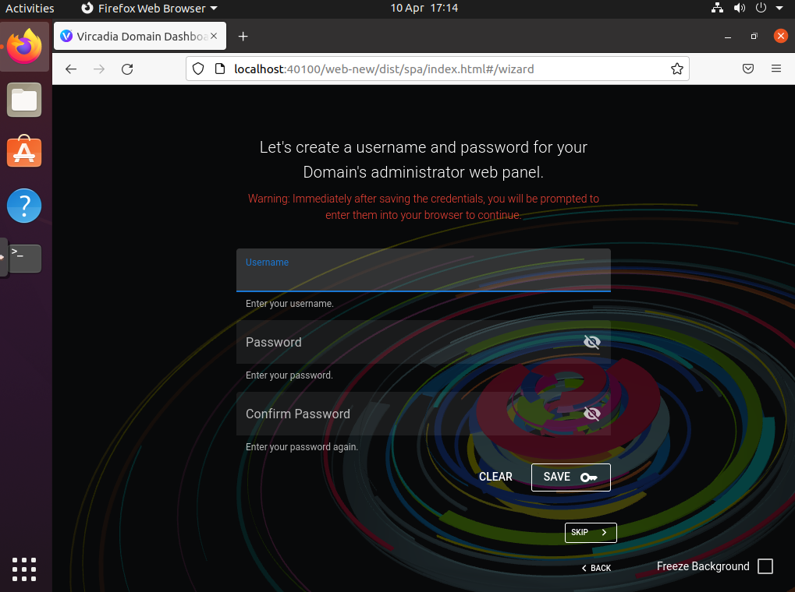

# Lab - Vircadia

## Overview

This part of the how-to serves as a guide to setting up a Vircadia domain server and metaverse server within the Proxmox VE environment.

To familiarise with the technology stack the [Vircadia architecture overview document](https://docs.vircadia.com/explore/get-started/architecture.html) is a good place to start and the [GitHub](https://github.com/vircadia/) contains documentation and source. 

## Deploy a Vircadia domain server

There are [few different options](https://vircadia.com/deploy-a-server/) to deploy a server. This guide will use the Linux compile from source method.

[Various Linux distributions are supported](https://github.com/vircadia/vircadia-builder#supported-platforms) and in this setup, Ubuntu 20.04 was selected.

### Prepare a virtual instance of Ubuntu 20.04 in the Proxmox Virtual Environment

First, obtain the Ubuntu 20.04 desktop image.

Then deploy a virtual machine in Proxmox VE as was done with VyOS and Debian in the previous sections. The following values were selected for this setup:


Disk drive: 64GiB \
CPU: 2 sockets 2 cores \
RAM: 8192GiB \
Network adapter: vmbr1 (internal) \
Name: vircadia-server 

When prompted by the installer to choose the packages to install choose 'minimal'.

Remember to remove the media.

Once booted, head to settings:


Then configure the network connection with the manual method:


With the following:

IP address: 192.168.y.4 \
Gateway: 192.168.y.1 \
DNS: 192.168.y.1 \
Mask 255.255.255.0

Run the software updater.

Restart and run the software updater again.

Once the Operating System is up to date open a terminal and install git:

`sudo apt install git`

Follow the [Vircadia build instructions](https://github.com/vircadia/vircadia-builder) along side this how-to guide.

Stood in your home directory or similar run the following:

```
git clone https://github.com/vircadia/vircadia-builder.git
cd vircadia-builder
chmod +x vircadia-builder
```

As this setup requires both the domain server and the ICE server, run the following:

./vircadia-builder --build=server,ice-server

It is also possible to add a 'client' option but this was not opted for in this setup as the client was [Windows based](#Client-interface).

Follow the prompts (defaults were accepted in this setup). The installation process will begin as shown below:


The first stage of the installer will install dependency packages, follow the instruction and then if prompted run the build command again.

Note: if you have followed the guide then Qt will not be installed on the target system, however, the installer will build the correct version - see below:


Once complete (which could take several hours for the Qt step) a text output similar to the following should be presented:

```
Cleaning up install directory...done
Copied : 4626
Skipped: 3208
Deleted: 0
Creating script for assignment-client...done.
Creating script for domain-server...done.
Creating service for assignment-client...done.
Creating service for domain-server...done.
Reloading systemd config... done.


############################################################
# Setting up desktop
############################################################

interface not built, skipping desktop setup
```

Navigate up one from the build directory and into the Vircadia folder. In here there should be a build folder with the built binaries and accompanying scripts - these are the scripts that will be run later (@todo: section link: ### Configure the Vircadia server) once port forwarding is configured.

### Configure port forwarding for Vircadia services

The following ports are required:

40100 (+0): (tcp) administrative http connection

40101 (+1): (tcp) administrative https (encrypted) connection

40102 (+2): (udp) main connection from clients

40103 (+3): (udp) main connection from clients (encrypted)

Note: in this setup non TLS versions are currently used for testing.

Important: for a production version of the system it would be prudent to enable TLS and completely disallow non TLS traffic (i.e. remove the port forwarding rules)

```
set nat destination rule 15 description 'Port Forward: 40100 (+0): (tcp) administrative http connection on 192.168.y.4'
set nat destination rule 15 destination port '40100'
set nat destination rule 15 inbound-interface 'eth0'
set nat destination rule 15 protocol 'tcp'
set nat destination rule 15 translation address '192.168.y.4'
set nat destination rule 15 translation port '40100'

set nat destination rule 16 description 'Port Forward: 40101 (+1): (tcp) administrative https (encrypted) connection on 192.168.y.4'
set nat destination rule 16 destination port '40101'
set nat destination rule 16 inbound-interface 'eth0'
set nat destination rule 16 protocol 'tcp'
set nat destination rule 16 translation address '192.168.y.4'
set nat destination rule 16 translation port '40101'

set nat destination rule 17 description 'Port Forward: 40102 (+2): (udp) main connection from clients on 192.168.y.4'
set nat destination rule 17 destination port '40102'
set nat destination rule 17 inbound-interface 'eth0'
set nat destination rule 17 protocol 'tcp'
set nat destination rule 17 translation address '192.168.y.4'
set nat destination rule 17 translation port '40102'

set nat destination rule 18 description 'Port Forward: 40103 (+3): (udp) main connection from clients (encrypted) on 192.168.y.4'
set nat destination rule 18 destination port '40103'
set nat destination rule 18 inbound-interface 'eth0'
set nat destination rule 18 protocol 'tcp'
set nat destination rule 18 translation address '192.168.y.4'
set nat destination rule 18 translation port '40103'

commit

save
```

### Configure port forwarding for the ICE server

```
set nat destination rule 21 description 'Port Forward for ice-server: 7337 to 7337 on 192.168.y.4'
set nat destination rule 21 destination port '7337'
set nat destination rule 21 inbound-interface 'eth0'
set nat destination rule 21 protocol 'tcp'
set nat destination rule 21 translation address '192.168.y.4'
set nat destination rule 21 translation port '7337'

commit

save
```

### Configure the Vircadia server

As per the information message:

"Connect a web browser to the server at port 40100. (If you are on the machine that the server is running on, this would be http://localhost:40100) Complete the initial setup wizard and you should have a functioning domain."

With the port forwarding in place it should be possible to access the web interface on: 192.168.x.z:40100

Start the configuration:


Select skip on the import settings and/or content page:



Select skip on the connect to metaverse account page:


Configure security settings for your domain:


Create an admin user for the web panel:



Choose if you would like to turn performance mode on (in the setup described here performance mode was turned on):


Complete the installation.

## Deploy a Vircadia metaverse server

Installation and configuration here follows the [Vircadia metaverse build guide](https://github.com/vircadia/vircadia-metaverse/blob/master/docs/Building.md) and [Iamus: Notes On Development](https://github.com/vircadia/vircadia-metaverse/blob/master/docs/NotesOnDevelopment.md).

It is possible to install and run the Vircadia metaverse server on the same server as the domain server, however, in this setup another VM was used (separation of concerns).

Note: make sure to put VM disk on the first local-lvm partition and not the Bitcoin specific one.

Create another VM as in the previous steps with the following configuration:

Disk drive: 64GiB \
CPU: 2 sockets 2 cores \
RAM: 8192GiB \
Network adapter: vmbr1 (internal) \
Name: vircadia-metaverse-server

Perform a minimal install of Ubuntu 20.04 Desktop and configure the network as follows:

IP address: 192.168.y.5 \
Gateway: 192.168.y.1 \
DNS: 192.168.y.1 \
Mask 255.255.255.0

Run the software updater.

Restart and run the software updater again.

### Install Node.js and NPM

Following the [building and configuration guide](https://github.com/vircadia/vircadia-metaverse/blob/master/docs/Building.md):

Note: as of writing the Node and NPM versions in the package manager are too low (node > 14 and npm > 6 are required) so do not use those. Instead navigate to: https://nodejs.org/en/download/ and get the latest LTS (version: 16.14.2 (includes npm 8.5.0) as of writing).

The following is taken from the [Node installation guide](https://github.com/nodejs/help/wiki/Installation):

```
sudo mkdir /usr/local/lib/nodejs
sudo tar -xJvf node-v16.14.2-linux-x64.tar.xz -C /usr/local/lib/nodejs/

nano ~/.profile
```

Add:

```
export PATH=/usr/local/lib/nodejs/node-v16.14.2-linux-x64/bin:$PATH
```

and refresh (@todo) and check

```
$ node -v

$ npm version

$ npx -v
```

### Installation of the Vircadia metaverse server

Navigate to ~ (or where you would like to locate the meteverse server repository) and then run the following:

```
$ git clone https://github.com/vircadia/vircadia-metaverse.git

Cloning into 'vircadia-metaverse'...
remote: Enumerating objects: 5134, done.
remote: Counting objects: 100% (1240/1240), done.
remote: Compressing objects: 100% (700/700), done.
remote: Total 5134 (delta 862), reused 823 (delta 488), pack-reused 3894
Receiving objects: 100% (5134/5134), 1.04 MiB | 1.10 MiB/s, done.
Resolving deltas: 100% (3539/3539), done.
```

Change to the vircadia-metaverse directory and run the following command:

```
npm install
```

Note: As of writing the Git tags were old so the latest commit was opted for.

### Configure the Mongo DB for the metaverse server

Note: the Mongo DB could run on a separate VM (further separation of concerns).

The [Vircadia metaverse build guide](https://github.com/vircadia/vircadia-metaverse/blob/master/docs/Building.md) is shown using version 4.4 so this guide will use the same (though it maybe possible to use a later version (@todo: a comment in Discord mentions success with 5.0.2):

https://www.mongodb.com/docs/v4.4/tutorial/install-mongodb-on-ubuntu/

Follow the installation instructions for Ubuntu 20.04 (assuming that this is the distribution that has been chosen to install the metaverse server on).

Once the Mongo DB is complete it can be verified as below:

```

al@vircadia-metaverse-server:~$ mongo
MongoDB shell version v4.4.13
connecting to: mongodb://127.0.0.1:27017/?compressors=disabled&gssapiServiceName=mongodb
Implicit session: session { "id" : UUID("c7fdcc61-f921-4fff-ad44-27840a8afea4") }
MongoDB server version: 4.4.13
Welcome to the MongoDB shell.
For interactive help, type "help".
For more comprehensive documentation, see
        https://docs.mongodb.com/
Questions? Try the MongoDB Developer Community Forums
        https://community.mongodb.com
---
The server generated these startup warnings when booting:
        2022-04-11T12:50:28.108+01:00: Using the XFS filesystem is strongly recommended with the WiredTiger storage engine. See http://dochub.mongodb.org/core/prodnotes-filesystem
        2022-04-11T12:50:28.852+01:00: Access control is not enabled for the database. Read and write access to data and configuration is unrestricted
---
---
        Enable MongoDB's free cloud-based monitoring service, which will then receive and display
        metrics about your deployment (disk utilization, CPU, operation statistics, etc).

        The monitoring data will be available on a MongoDB website with a unique URL accessible to you
        and anyone you share the URL with. MongoDB may use this information to make product
        improvements and to suggest MongoDB products and deployment options to you.

        To enable free monitoring, run the following command: db.enableFreeMonitoring()
        To permanently disable this reminder, run the following command: db.disableFreeMonitoring()
---
>

```

Next:

```
mongo
db.disableFreeMonitoring()
use admin
db.createUser({user:"adminer", pwd: "aReallyComplexPassword1", roles: [ "root" ]})
use admin
db.createUser({user:"backuper", pwd: "aReallyComplexPassword2", roles: [ "backup" ]})
use admin
db.createUser({user:"cadiauser", pwd: "aReallyComplexPassword3", roles: [{ role: "readWrite", db: "domainstore" }]})
```

Then be sure to follow the step to add authorisation to mongo:

Edit /etc/mongod.conf and add:

```
security:
    authorization: enabled
```

then run the following command to restart Mongo DB:

```
sudo systemctl restart mongod.
```

### Configure the iamus configuration file

Next add the an iamus.json configuration file to the base directory.

You can take inspiration from:

1) the example in the build readme as shown below:

```

{
    "metaverse": {
        "metaverse-name": "My Metaverse",
        "metaverse-nick-name": "MyVerse",
        "metaverse-server-url": "https://metaverse.example.org:9400/",
        "default-ice-server-url": "ice.example.org:7337"
    },
    "server": {
        "cert-file": "config/cert.pem",
        "key-file": "config/privkey.pem",
        "chain-file": "config/chain.pem"
    },
    "metaverse-server": {
        "metaverse-info-addition-file": "config/metaverse_info.json"
    },
    "database": {
        "db": "myverse",
        "db-host": "metaverse.example.org",
        "db-user": "DBUSER",
        "db-pw": "DBUSERPASSWORD"
    },
    "debug": {
        "loglevel": "debug",
        "devel": true,
    }
}

```

2) the src/config.ts file in the @todo dir:

```

{
    // The metaverse identity
    'metaverse': {
        'metaverse-name': 'Vircadia noobie',
        'metaverse-nick-name': 'Noobie',
        'metaverse-server-url': '',   // if empty, set to self
        'default-ice-server-url': '', // if empty, set to self
        'dashboard-url': 'https://dashboard.vircadia.com'
    },
    // Server network parameters
    'server': {
        'listen-host': '0.0.0.0',
        'listen-port': 9400,
        'key-file': '',           // if supplied, do https
        'cert-file': '',
        'max-body-size': 300000,  // maximum body size for input JSON bodies
        'static-base': '/static', // base of static data URL
        'user-config-file': './iamus.json', // startup config over-ride
        'server-version': {       // overlaid with VERSION.json
            'version-tag': '1.1.1-20200101-abcdefg'
        }
    },
    // Authorization token parameters
    'auth': {
        'domain-token-expire-hours': 24 * 365,  // one year
        'owner-token-expire-hours': 24 * 7      // one week
    },
    // Control of the metaverse operations
    'metaverse-server': {
        'http-error-on-failure': true,  // whether to include x-vircadia error header
        'error-header': 'x-vircadia-error-handle',

        'metaverse-info-addition-file': './metaverse_info.json',
        'max-name-length': 32,      // the max characters a domain, place, account, ... name

        'session-timeout-minutes': 5,
        'heartbeat-seconds-until-offline': 5 * 60,      // seconds until non-heartbeating user is offline
        'domain-seconds-until-offline': 10 * 60,        // seconds until non-heartbeating domain is offline
        'domain-seconds-check-if-online': 2 * 60,       // how often to check if a domain is online
        'handshake-request-expiration-minutes': 1,      // minutes that a handshake friend request is active
        'connection-request-expiration-minutes': 60 * 24 * 4, // 4 days
        'friend-request-expiration-minutes': 60 * 24 * 4,     // 4 days

        'place-current-timeout-minutes': 5,             // minutes until current place info is stale
        'place-inactive-timeout-minutes': 60,           // minutes until place is considered inactive
        'place-check-last-activity-seconds': (3*60)-5,  // seconds between checks for Place lastActivity updates

        // redirection URL used for initial domain token generation,
        //   "METAVERSE_SERVER_URL" is replaced (from Config.metaverse.metaverse-server-url)
        //   "DASHBOARD_URL" is replaced (from Config.metaverse.dashboard-url)
        'tokengen_url': 'METAVERSE_SERVER_URL/static/DomainTokenLogin.html',
        // 'tokengen_url': 'DASHBOARD_URL?metaverse=METAVERSE_SERVER_URL&page=domain',

        // When account of this name is created, add 'admin' role to it
        //    Initially as empty so random people cannot create an admin account
        //    The account named here MUST be controlled by the server's admin
        'base-admin-account': '',

        // If to assume domain network_address if on is not set
        'fix-domain-network-address': true,
        // Whether allowing temp domain name creation
        'allow-temp-domain-creation': false,

        // Email verification on account creation
        'enable-account-email-verification': false,
        'email-verification-timeout-minutes': 1440, // minutes to wait for email verification (1440=one day)
        // default is in 'static' dir. If you put in 'config' dir, use 'config/verificationEmail.html'.
        //   "VERIFICATION_URL" is replaced with the computed URL (build with Config.metaverse-server-url)
        //   "METAVERSE_NAME" is replaced (from Config.metaverse.metaverse-name)
        //   "SHORT_METAVERSE_NAME" is replaced (from Config.metaverse.metaverse-nick-name)
        'email-verification-email-body': 'dist/static/verificationEmail.html',  // file to send
        'email-verification-from': '', // who the email is From
        // When user follows the verification URL, they are redirected to one of these two URLs
        //   "METAVERSE_SERVER_URL" is replaced (from Config.metaverse.metaverse-server-url)
        //   "DASHBOARD_URL" is replaced (from Config.metaverse.dashboard-url)
        //   "ACCOUNT_ID" is replaced with the verifying account id
        //   "FAILURE_REASON" is replaced with the reason for verification failure (url encoded)
        'email-verification-success-redirect': 'METAVERSE_SERVER_URL/static/verificationEmailSuccess.html',
        'email-verification-failure-redirect': 'METAVERSE_SERVER_URL/static/verificationEmailFailure.html?r=FAILURE_REASON'
    },
    // SMTP mail parameters for out-bound email
    // This is the structure that is passed to NodeMailer's SMTP transport.
    // Check out the documentation at https://nodemailer.com/smtp/
    // For SMTP outbound, setup your email account on your service and
    //     update SMTP-HOSTNAME, SMTP-USER, and SMTP-PASSWORD with your info.
    'nodemailer-transport-config': {
        'host': 'SMTP-HOSTNAME',
        'port': 465,    // 587 if secure=false
        'secure': true,
        'auth': {
            'user': 'SMTP-USER',
            'pass': 'SMTP-PASSWORD'
        }
    },
    'monitoring': {
        'enable': true,           // enable value monitoring
        'history': true           // whether to keep value history
    },
    // Setup for MongoDB access
    'database': {
        'db-host': 'localhost',
        'db-port': 27017,
        'db': 'tester',
        'db-user': 'metaverse',
        'db-pw': 'nooneknowsit',
        'db-authdb': 'admin',
        'db-connection': ''   // connection string replaces above if supplied
    },
    // MongoDB account configured for database backup script
    'backup': {
        "backup-user": "backuper",  // database backup user account (for BackupDb.sh)
        "backup-pw": "nooneknowsit", // database backup user password (for BackupDb.sh)
        "backup-dir": "directoryName", // Backup file directory. Optional. Defaults to "./DatabaseBackup"
        "authenticationDatabase": "databaseName" // auth db for backup user. Optional. Defaults to "admin"
    },
    'debug': {
        'loglevel': 'info',

        // Winston logging configuration
        'log-to-files': true,         // if to log to files
        'log-filename': 'iamus.log',  // filename for log files
        'log-directory': './logs',    // directory to place logs
        'log-max-size-megabytes': 100,// max mega-bytes per log file
        'log-max-files': 10,          // number of log files to create
        'log-tailable': true,         // if to always output to main named log file
        'log-compress': false,        // if to compress old log files

        'log-to-console': false,      // if to additionally log to the console

        'devel': false,

        // Control of what debug information is logged
        'request-detail': false,  // output the received request info when received
        'request-body': false,    // output the received request body when received
        'metaverseapi-response-detail': false, // output the response sent back from MetaverseAPI requests
        'query-detail': false,    // outputs details when selecting query parameters
        'db-query-detail': false, // outputs details about DB queries
        'field-setting': false    // Details of entity field getting and setting
    }
}

```

3) the file used in this setup:

```
@todo: insert file
```

### Configure port forwarding for the metaverse server

```
set nat destination rule 20 description 'Port Forward for metaverse: 9400 to 9400 on 192.168.y.5'
set nat destination rule 20 destination port '9400'
set nat destination rule 20 inbound-interface 'eth0'
set nat destination rule 20 protocol 'tcp'
set nat destination rule 20 translation address '192.168.y.5'
set nat destination rule 20 translation port '9400'
```

### Configuring NAT reflection on the VyOS router (testing)

Many routers will automatically configure NAT reflection for open ports and [VyOS can be configured to perform NAT reflection](https://docs.vyos.io/en/equuleus/configuration/nat/index.html#hairpin-nat-nat-reflection). This requires a few updates to the existing rules that have been configured. NAT reflection would be useful for internal only debugging, however, in testing the ICE server from the build would only bind to the external internet routable IP thus hindering the ability to use internally. As using ICE for internal only is an edge case this is actually as expected although future work could look into updating the ICE server and configuring split DNS (feel free to update with suggestions). With this in mind the setup described here, at present, does not require NAT reflection but the following updates should enable it if desired:

```
set nat destination rule 16 destination address 192.168.x.z
set nat destination rule 17 destination address 192.168.x.z
set nat destination rule 18 destination address 192.168.x.z
set nat destination rule 20 destination address 192.168.x.z
set nat destination rule 21 destination address 192.168.x.z

set nat destination rule 16 inbound-interface any
set nat destination rule 17 inbound-interface any
set nat destination rule 18 inbound-interface any
set nat destination rule 20 inbound-interface any
set nat destination rule 21 inbound-interface any

commit

save

```

### Enabling external access

Important note: in a development and testing environment (such as the one detailed here) the VyOS router should not be permanently connected to the internet and access should only be allowed whilst tests are being performed and if possible tied down to specific source addresses. To allow testing the external firewall requires port forwarding. The port forwarding rules can be turned on and off as desired.

The following port forwarding rules are required:

Name | Port | Destination IP | Protocol
--- | --- | --- | ---
Vircadia 40102 (udp) main connection from clients | 40102 | 192.168.x.y | UDP
Vircadia 7337 (both) ice-server | 7337 | 192.168.x.y | TCP+UDP
Vircadia 9400 (tcp) metaverse-server | 9400 | 192.168.x.y | TCP

Note: the configuration and starting of the services will reference the external IP address a.b.c.d

### Start the services

The process of starting the services is as follows (see: [Building and Running Ice-Server and Domain-Server](https://github.com/vircadia/vircadia-metaverse/blob/master/docs/NotesOnDevelopment.md#building-and-running-ice-server-and-domain-server)

#### Metaverse server service

On the metaverse server open a terminal and run:

```
cd vircadia-metaverse

node/dist/index.ts
```

#### ICE server

Start ice-server.

On the vircadia server open a terminal and run:

```
cd Vircadia/vircadiaBuildDir
export HIFI_METAVERSE_URL=http://a.b.c.d:9400
./run_ice-server
```

#### Domain server services

Start domain-server.

Open another terminal and run:

```
cd Vircadia/vircadiaBuildDir
export HIFI_METAVERSE_URL=http://a.b.c.d:9400
export ICE_SERVER=a.b.c.d:7337
./run_domain-server -i ${ICE_SERVER}
```

Start assignment client.

Open another terminal and run:

```
cd Vircadia/vircadiaBuildDir
./run_assignment-client
```

#### Client interface

For testing the client application the Windows OS was opted for and [Vircadia 2022.1.1](https://github.com/vircadia/vircadia/releases/tag/2022.1.1) was used.

### Connecting the Metaverse server and configuring a test Metaverse account

Navigate to:

http://192.168.x.y:40100/settings/#metaverse_group (or use the external IP a.b.c.d)

Then click 'Connect Metaverse Account'

A new page should open (http://a.b.c.d:9400/static/DomainTokenLogin.html) with the option to 'create account'. Do this and then enter the username and password on the 'Get Token'. Copy this token and then go back to the previous page and paste it in the open dialogue and click connect. The Networking / Metaverse section should now display 'Metaverse Account Connected'.

Note: at this point you could create a few more accounts for testing.

### Connecting a client

If you are testing locally then you will probably need to use a VPN so that your connection is routed from outside your local network. This is due to the ICE server and how it will create open ports. The NAT reflection required will probably not work on the external router for non static port forwarding rules.

From tests it appears that the best way to run the client is to start it from the command line with the IP for the domain server (at least for the initial run and then it seems to work fine then in).

For the initial run the following was actioned:

Open a terminal (PowerShell on Windows in this case), navigate to the folder containing the Vircadia executable and run:

```
.\interface.exe --url 84.92.193.1
```

Then in the interface navigate to File -> Metaverse: Login / Sign Up

Enter the details as follows:

Display name: XYZ
Username: usernameCreatedInPreviousStep
Password: passwordCreatedInPreviousStep
URL: http://a.b.c.d:9400

Then click 'Log in to metaverse'

### Configure SSH access for domain and metaverse servers (optional)

For potentially easier debugging, enable SSH on the servers.

Open a terminal and type:

`sudo apt install openssh-server`

Then configure the following rules on the VyOS router:

#### Domain server

Then set up port forwarding on the VyOS router... @todo add $VyOS

```
configure

set nat destination rule 14 description 'Port Forward: 2224 to 22 SSH on 192.168.y.4'
set nat destination rule 14 destination port '2224'
set nat destination rule 14 inbound-interface 'eth0'
set nat destination rule 14 protocol 'tcp'
set nat destination rule 14 translation address '192.168.y.4'
set nat destination rule 14 translation port '22'

commit
```

Test the SSH access and if all works well:

```
save
```

#### Metaverse server

Configure SSH access and port forwarding on the VyOS if desired:

```
configure

set nat destination rule 19 description 'Port Forward: 2225 to 22 SSH on 192.168.y.5'
set nat destination rule 19 destination port '2225'
set nat destination rule 19 inbound-interface 'eth0'
set nat destination rule 19 protocol 'tcp'
set nat destination rule 19 translation address '192.168.y.5'
set nat destination rule 19 translation port '22'

commit
```

Test the SSH access and if all works well:

```
save
```